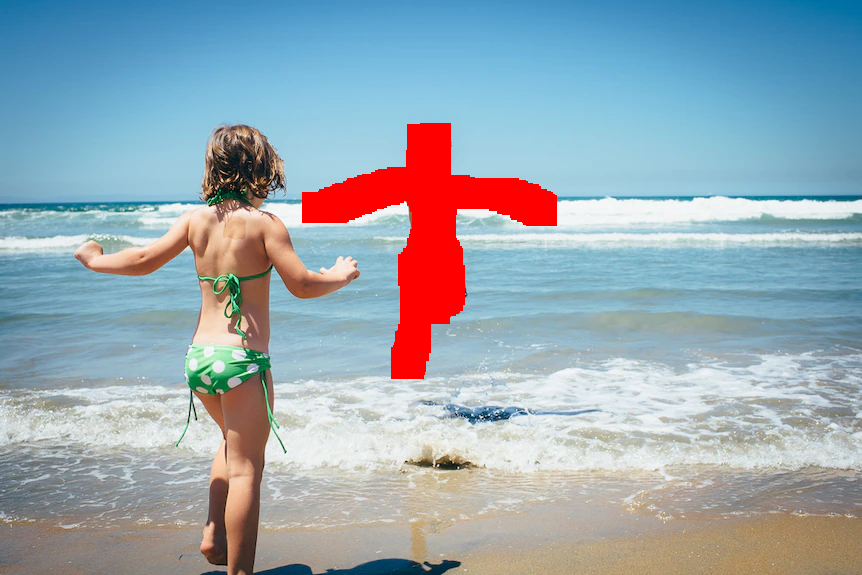
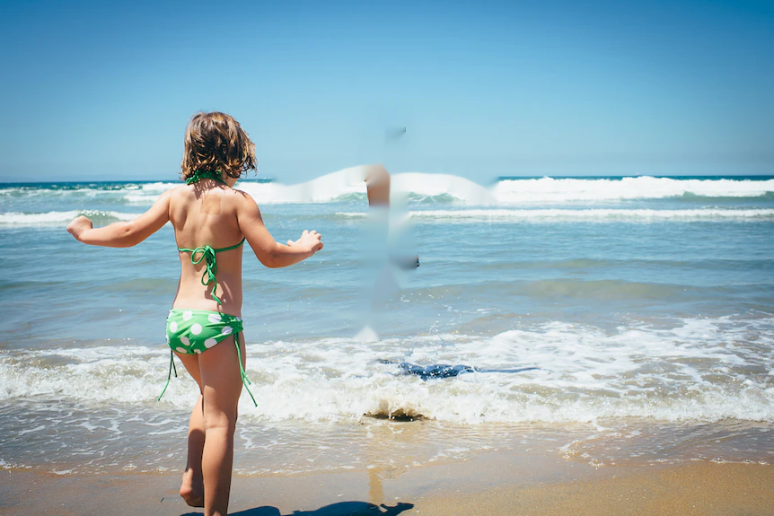
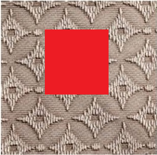
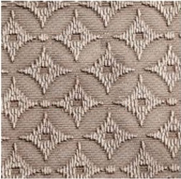
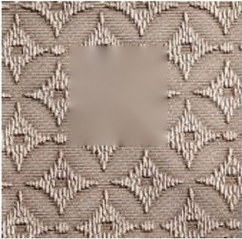
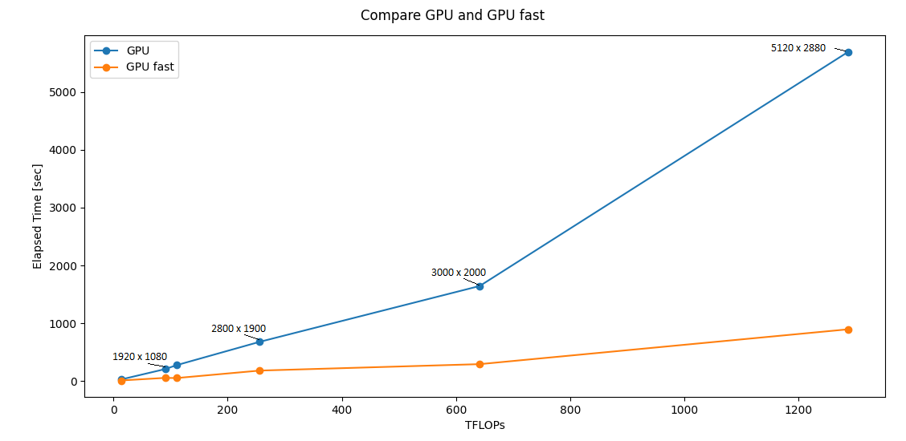

# Introduction

<b>MagicInpaint</b> is image processing Python library for high quality image reconstruction and inpaint. It is available for the GPU and CPU. There is also and image processing tool using the library available here - https://github.com/antonmilev/MagicInpainter.

To install MagicInpaint for GPU:
```
pip install magicinpaint-gpu
```

To test if MagicInpaint is installed:

```python
import magicinpaint as mi
mi.version()
```

Normally, this should print the version and the application type:

```
MagicInpaint 1.01 (gpu)

```

To install MagicInpaint for CPU:
```
pip install magicinpaint-cpu
```
<p>:warning:<b>Please Note: </b>
<br>For the GPU version to work you need NVIDIA GPU card and correctly installed CUDA driver (GTX or RTX)!</p> 


## Inpaint with MagicInpaint

To use <b>MagicInpaint</b> for image files with cv2:

```python
import numpy as np
import magicinpaint as mi
import os,sys
import cv2

# check magicinpaint version
print(mi.version())

img_path = '08_beach1.jpg'
mask_path = '08_beach1_mask.png'
out_path = '08_beach1_inpaint.png'

img = cv2.imread(img_path)
if img is None:
    print('Can not open image:', img_path)
    exit() 

mask = cv2.imread(mask_path, cv2.IMREAD_GRAYSCALE)
if mask is None:
    print('Can not open mask:', mask_path)
    exit() 

mi.inpaint(img, mask, 15, mi.InpaintGPUfast, verbose = True) 

cv2.imshow('dst', img)
cv2.imwrite(out_path, img)
cv2.waitKey(0)
cv2.destroyAllWindows()

```
Output:

```text

Noise Pixels:       20221
Image Pixels:       495650
Radius:             15
Inpaint Method:     GPU Fast
TFLOPS:             28.8950
Starting Inpaint.....
Press ESC to cancel
----10%----20%----30%----40%----50%----60%----70%----80%----90%----100%
Inpainting Completed
Inpaint time:       21375.00 ms
Saving output image....

```

Use without OpenCV:

There is also a method that allows to process image files directly (supported image extensions are JPG,BMP,PNG):

```python
import magicinpaint as mi

# check magicinpaint version
print(mi.version())

img_path = 'test/cloth1_red1.png'
mask_path = 'test/cloth1_mask.png'
out_path = 'results_mi/cloth1_inpaint_mi_GPUfast_r10.png'

mi.inpaint_file(img_path, mask_path, out_path, 30, mi.InpaintGPUfast, verbose = True) 
```

Desription of the function arguments:
<ul>
  <li><b>image_file</b> - path to color image file, supported formats JPG,BMP,PNG</li>
  <li><b>mask_file</b> - path to mask black-white image file, 0-valid pixels, 255- noise pixels to remove</li> 
  <li><b>out_path</b> - path to output image file, if None result is saved in image file with appended string "onpaint"</li> 

  <li><b>rad</b>  - inpaint radius, limited to <b>64</b></li>
  <li><b>method</b>  - inpaint method, see below</li>
  <li><b>verbose</b> - print details, by default is <b>False</b></li>
</ul> 

Function outputs <b>True</b> if sucessful, otherwise <b>False</b>. The smae

## Inpaint with OpenCV
To use OpenCV inpaint see https://docs.opencv.org/3.4/df/d3d/tutorial_py_inpainting.html:

Inpaint with cv2.INPAINT_NS:

```python
import numpy as np
import cv2 

img_path = 'test/08_beach1.png'
mask_path = 'test/08_beach1_mask.png'
out_path = 'results_cv2/08_beach1_inpaint_cv2_NS_r30.png'

img = cv2.imread(img_path)

if img is None:
    print('can not open image:', img_path)
    exit() 

mask = cv2.imread(mask_path, cv2.IMREAD_GRAYSCALE)
dst = cv2.inpaint(img,mask,30,cv2.INPAINT_NS)
cv2.imshow('dst', dst)
cv2.imwrite(out_path, dst)
cv2.waitKey(0)
cv2.destroyAllWindows()

```

Inpaint with cv2.INPAINT_TELEA:


```python
import numpy as np
import cv2

img_path = 'test/cloth1_red1.png'
mask_path = 'test/cloth1_mask.bmp'
out_path = 'results_cv2/cloth1_inpaint_cv2_Telea_r30.png'

img = cv2.imread(img_path)

if img is None:
    print('can not open image:', img_path)
    exit() 

mask = cv2.imread(mask_path, cv2.IMREAD_GRAYSCALE)
dst = cv2.inpaint(img,mask,30,cv2.INPAINT_TELEA)
cv2.imshow('dst', dst)
cv2.imwrite(out_path, dst)
cv2.waitKey(0)
cv2.destroyAllWindows()
```

# Test Results

Results from the examples above:


|  |   |  |  | 
|---|---|---|---| 
| *<b>Original Image</b>* | *<b>Mask image</b>* | *<b>MagicInpaint, R15</b>* |  *<b>OpenCV, R30</b>* | 


|  |   |  |   | 
|---|---|---|---| 
| *<b>Original Image</b>* | *<b>Mask image</b>* | *<b>MagicInpaint, R30</b>* | *<b>OpenCV, R30</b>* |


OpenCV inpaint methods are faster but works well only for small scratches and line defects. 

## Inpaint methods

Following MagicInpaint methods are available:

- **InpaintCPU** - this is the default inpaint method if GPU with CUDA is missing. Results can be worse and this method would be too slow so is not recommended for images with high resolution and large noise area.

- **InpaintGPU** - this is the most precise GPU method, however for high resolution is also too slow 

- **InpaintGPUfast** - this is the recomended GPU method for real-life photos, results can be very little worse but perfomance can rise more than 500 percents

Below is shown comparison between <b>InpaintGPU</b> and <b>InpaintGPUFast</b> and expected times for different image resolutions obtained with <b>RTX 3060:</b>
<p align="center">

</p>

## Limitations

<ul>
  <li>Curently the library is avaliable and tested only for Windows and Python versions Python <b>3.6</b> - Python <b>3.12</b></li>
  <li>Inpaint radius is limited to <b>64</b></li>
  <li>For very large image resolutions above 4K and large noise area inpaint can be too slow</li>
</ul> 

For more details see: https://github.com/antonmilev/MagicInpainter.


# Future Work
In comming releases there would be several improvements:

- **GPU performance** - several optimizations are possible for the GPU to work even faster, also search algorithms can be greately improved

- **Images with larger resolution**
Optimization algorithms used in MagicInpainter 3.0 become sometimes too slow and unstable for images with high resolution (in these cases <b>Zoom In/Out</b> buttons can be used). One other limitation is that inpaint radius can not exceed <b>64</b> pixels. 

- **Processing several images and video**
MagicInpainter 3.0 is currently limited to single photos.

- **Use AI and deep learning to speed up algorithms and optimal inpaint radius selection**
Assist inpaint algorithms with AI for classification, automation of algorithms type and optimal radius size selection. Used here inpaint algorithms can be combined with various neural networks models, especially in the cases when inpaint involves complicated features and big resolution, speed can be also significantly improved. 


